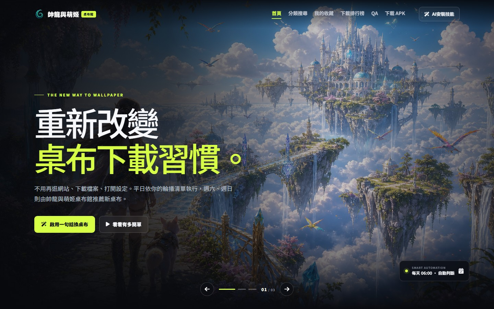
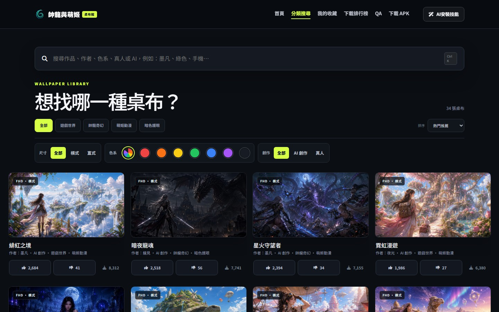
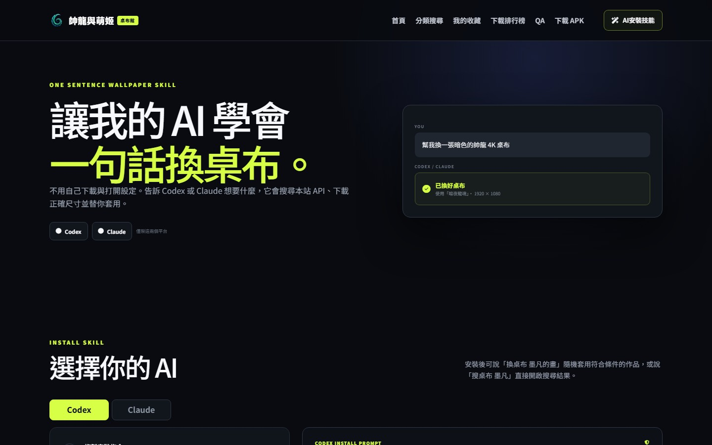
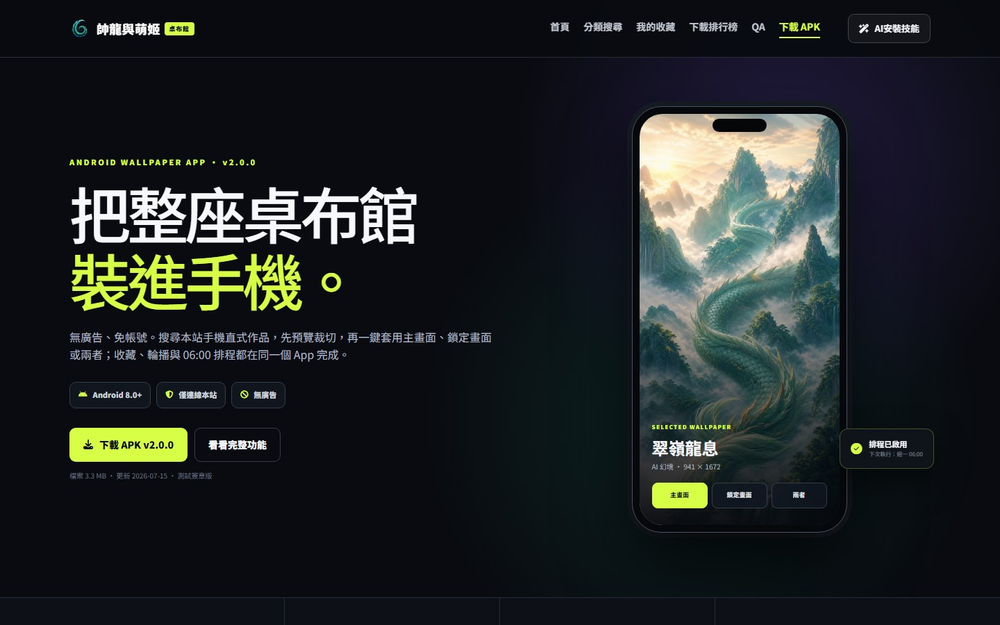

<div align="center">

# 帥龍與萌姬桌布館

### 一句話搜尋、下載並更換桌布

以 PHP、JavaScript 與 JSON 建立的響應式桌布平台，整合 **Codex／Claude 本機技能**、桌布收藏與輪播、公開統計 API、PWA，以及 Android 桌布 App。

[線上網站](https://4k.1-0.tw/) · [分類搜尋](https://4k.1-0.tw/search) · [AI 技能](https://4k.1-0.tw/ai-skill) · [API 文件](https://4k.1-0.tw/api-docs)

</div>



## 專案特色

| 功能 | 說明 |
| --- | --- |
| 智慧桌布目錄 | 依關鍵字、主題、顏色、裝置、方向與創作類型組合篩選。 |
| JPG-only 規範 | 公開目錄的 34 張桌布全部使用真實 JPEG 檔案，測試會同時檢查副檔名、檔案存在與 JPEG 簽章。 |
| 一句話換桌布 | Codex／Claude 技能可理解「換桌布」及帶條件的自然語言指令。 |
| 收藏與輪播 | 以匿名 `client_id` 保存收藏、AI 輪播清單、目前桌布與排程偏好。 |
| 公開互動統計 | 提供瀏覽、喜歡、不喜歡及下載資料，並以檔案鎖避免並行覆寫。 |
| PWA 與離線支援 | Web App Manifest、Service Worker、離線頁面及安裝捷徑。 |
| Android App | 支援搜尋、預覽、收藏、排程，以及套用主畫面／鎖定畫面桌布。 |
| 響應式介面 | 深色視覺系統，支援桌機、平板與手機操作。 |

## 桌布搜尋與分類

搜尋頁會從 `json/wallpapers.json` 載入目錄，可依作品、作者、色系、PC／手機、橫式／直式、AI／真人等條件縮小結果。使用者可直接收藏、加入輪播清單、投票或下載原圖。



## Codex／Claude 一句話換桌布

技能會向本站 API 查詢符合條件的桌布，驗證 HTTPS 下載網址與圖片，再套用至目前的 Windows 電腦。成功後才會更新本機狀態與網站偏好資料。

可辨識的說法包括：

```text
換桌布
換桌布 暗色的帥龍 4K 桌布
換桌布 綠色系 AI 手機桌布
搜桌布 墨凡
```

安裝技能時，請使用 GitHub Raw 網址：

- [Codex SKILL.md](https://raw.githubusercontent.com/suffixbig/4k/main/downloads/codex/SKILL.md)
- [Claude SKILL.md](https://raw.githubusercontent.com/suffixbig/4k/main/downloads/claude/SKILL.md)

```text
請下載並安裝 https://raw.githubusercontent.com/suffixbig/4k/main/downloads/codex/SKILL.md
```



## Android 桌布 App

Android 版本將網站目錄帶進手機，提供作品搜尋、分批載入、收藏同步、每日 06:00 排程，以及主畫面、鎖定畫面或兩者同時套用。APK 可由網站的「下載 APK」頁取得。



## 技術組成

- 後端：PHP 8、JSON 檔案儲存、Apache Rewrite
- 前端：原生 JavaScript、jQuery、Bootstrap、Font Awesome、Chart.js
- PWA：Web App Manifest、Service Worker、離線快取
- 測試：Node.js、Playwright
- 圖片目錄：JPG 桌布與獨立品牌圖示資產

## 本機啟動

### 需求

- PHP 8.1 或更新版本
- Node.js 18 或更新版本
- Apache／WAMP，或 PHP 內建伺服器

### 安裝

```bash
git clone https://github.com/suffixbig/4k.git
cd web_4k
npm install
```

建立本機專用的 `config.local.php`，填入自己的資料庫及整合服務設定。此檔已列入 `.gitignore`，請勿提交密碼、Token 或正式環境憑證。

使用專案測試 Router 啟動：

```bash
php -S 127.0.0.1:8788 tests/php-router.php
```

開啟 <http://127.0.0.1:8788/>。

## 測試

```bash
# 驗證桌布目錄全部為真實 JPG
npm test

# AI 技能頁與 GitHub 技能網址
npm run test:ai-skill

# Android App 下載頁
npm run test:android-app

# 響應式版面、觸控尺寸與功能頁
npm run test:rwd
```

瀏覽器測試前請先在 `127.0.0.1:8788` 啟動 PHP 測試伺服器。

## API 概覽

| 端點 | 用途 |
| --- | --- |
| `GET /api/` | API 探索首頁。 |
| `GET /api/catalog.php` | 取得公開桌布目錄及篩選結果。 |
| `GET /api/stats.php` | 讀取公開互動統計。 |
| `POST /api/stats.php` | 更新喜歡、不喜歡、瀏覽或下載數。 |
| `POST /api/preferences.php` | 保存收藏、輪播、排程與目前桌布。 |
| `GET /api/automation.php` | 產生立即換圖或排程換圖決策。 |

完整契約、參數與錯誤處理請參閱 [AI_API_GUIDE.md](AI_API_GUIDE.md) 與 [api/API_DEVELOPMENT.md](api/API_DEVELOPMENT.md)。

## 主要目錄

```text
web_4k/
├─ READMEJPG/             # GitHub README 專用 JPEG 展示圖
├─ api/                   # 公開目錄、統計、偏好與自動化 API
├─ downloads/             # Codex／Claude 技能及 Android APK
├─ json/                  # 桌布目錄、統計種子與執行期資料
├─ skin/
│  ├─ css/                # 網站視覺、RWD 與元件樣式
│  ├─ img/assets/         # 品牌素材與桌布 JPG
│  └─ js/                 # 搜尋、收藏、排行、PWA 與技能頁邏輯
├─ tests/                 # JPG 規範與 Playwright 瀏覽器測試
├─ ai-skill.php           # AI 技能安裝與預覽頁
├─ android-app.php        # Android App 介紹及下載頁
├─ search.php             # 桌布搜尋與分類頁
└─ sw.js                  # Service Worker
```

## 資料與安全

- `config.local.php`、上傳暫存檔、使用者偏好、執行期統計與測試截圖不會提交至 Git。
- 投稿端點只接受 20 MB 以下、MIME 為 `image/jpeg` 的有效圖片。
- 公開目錄更新後應執行 `npm test`，避免非 JPG 或遺失檔案進入清單。
- 正式環境請限制 JSON／上傳目錄權限，並將所有密碼與 Token 留在伺服器端設定。

## 授權

程式碼目前依 `package.json` 標示為 ISC。桌布、品牌素材與第三方套件仍分別受其原作者、授權條款及著作權規範約束。
